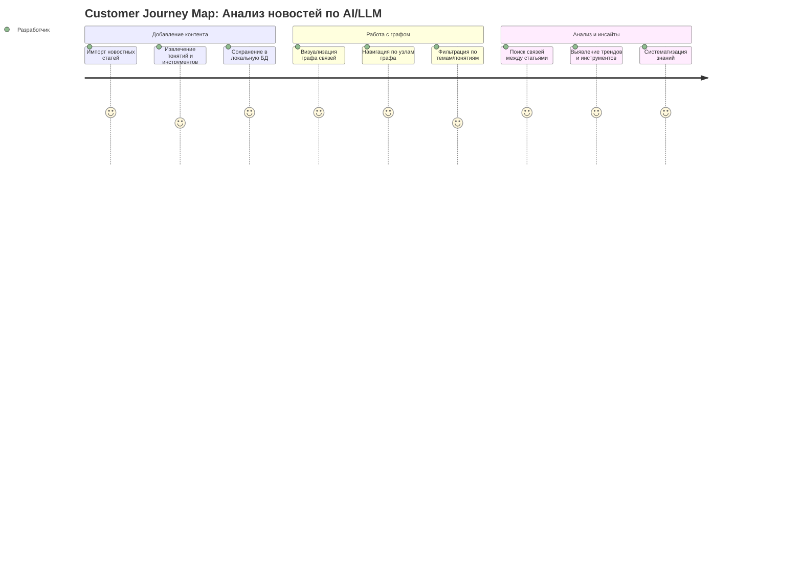

# Customer Journey Map: Knowledge Graph News App

## Путь пользователя

## Маппинг стори

| ID | История | Секция | Приоритет |
|----|---------|--------|-----------|
| STORY-001 | Импорт новостных статей | Добавление контента | High |
| STORY-002 | Извлечение понятий и инструментов | Добавление контента | High |
| STORY-003 | Сохранение в локальную БД | Добавление контента | High |
| STORY-004 | Визуализация графа связей | Работа с графом | High |
| STORY-005 | Навигация по узлам графа | Работа с графом | High |
| STORY-006 | Фильтрация по темам/понятиям | Работа с графом | Medium |
| STORY-007 | Поиск связей между статьями | Анализ и инсайты | Medium |
| STORY-008 | Выявление трендов и инструментов | Анализ и инсайты | Low |
| STORY-009 | Систематизация знаний | Анализ и инсайты | Low |

## Детали стори

Файлы с детальными критериями приёмки находятся в папке `stories/`:
- [STORY-001: Импорт статей](stories/01-import-articles.md)
- [STORY-002: Извлечение понятий](stories/02-extract-concepts.md)
- [STORY-003: Сохранение в БД](stories/03-save-to-db.md)
- [STORY-004: Визуализация графа](stories/04-visualize-graph.md)
- [STORY-005: Навигация по графу](stories/05-navigate-graph.md)
- [STORY-006: Фильтрация](stories/06-filter-graph.md)
- [STORY-007: Поиск связей](stories/07-search-connections.md)
- [STORY-008: Тренды](stories/08-detect-trends.md)
- [STORY-009: Экспорт](stories/09-knowledge-systematization.md)