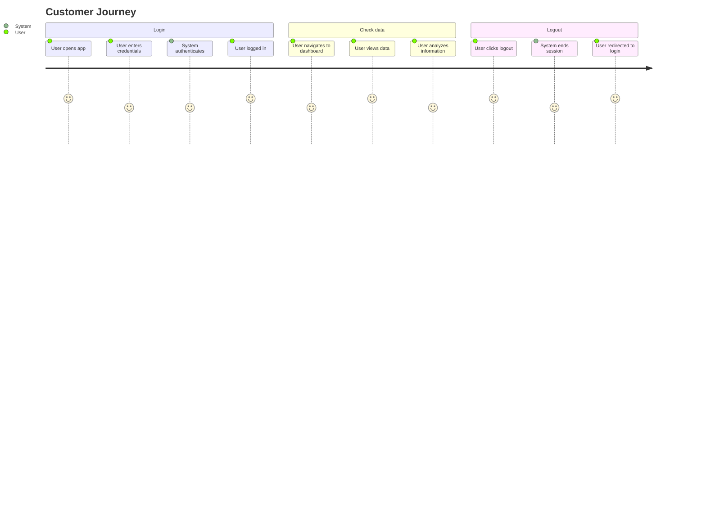

# Customer Journey Map

---

## Login

The customer initiates their journey by accessing the application and providing their authentication credentials. The system validates the user's identity and grants access to the platform.

## Check data

Once authenticated, the customer navigates through the application to view and analyze their data. This step represents the core value delivery where users interact with the information they need.

## Logout

After completing their tasks, the customer securely exits the application by terminating their session, ensuring their account remains protected.